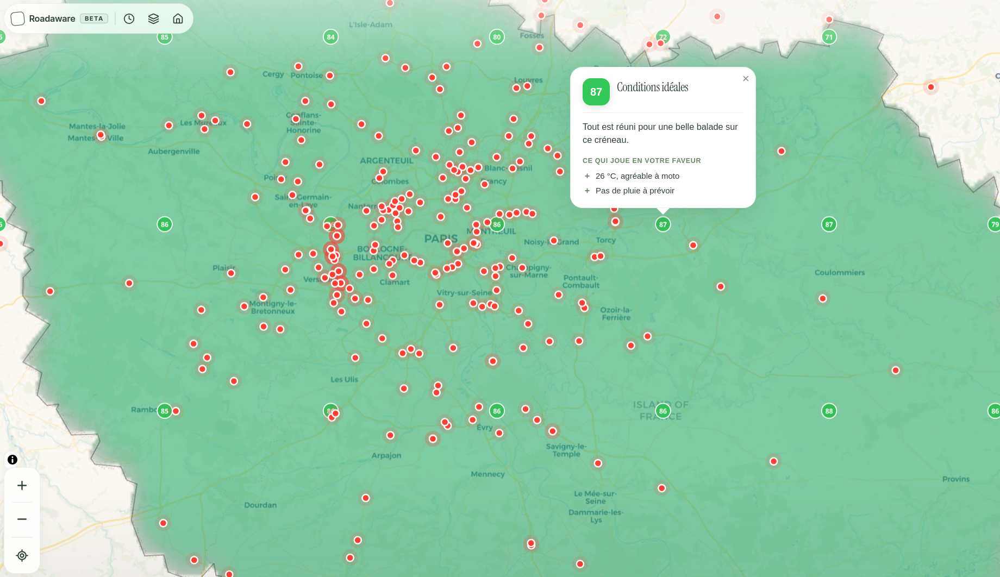
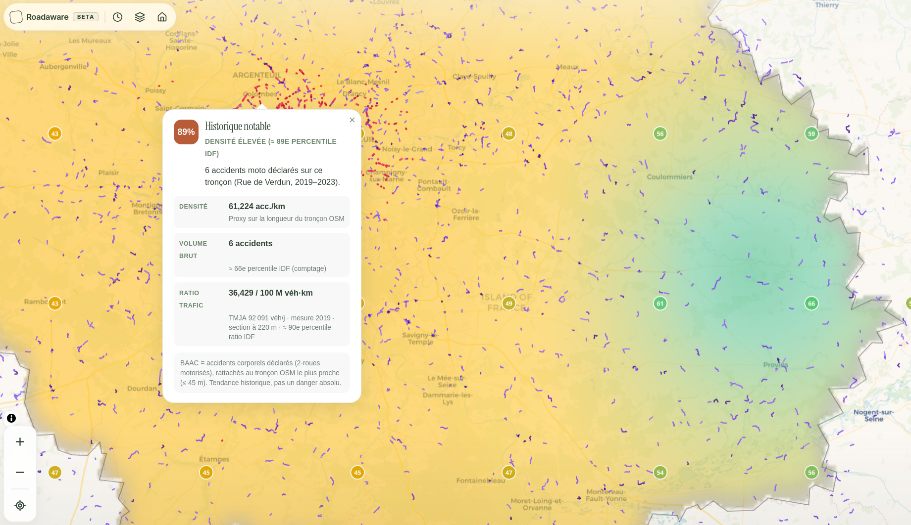
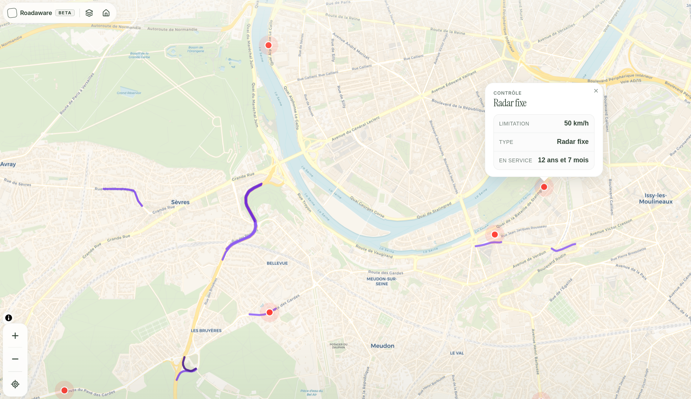

<p align="center">
  
</p>

# Roadaware

Carte moto **Île-de-France** — open data, sans GPS, sans compte.  
Tu explores une zone, tu actives des calques, tu décides si c’est le bon moment pour rouler.

**→ [roadaware.gondawa.fr](https://roadaware.gondawa.fr)** · [carte `/app`](https://roadaware.gondawa.fr/app) · [légal](https://roadaware.gondawa.fr/legal) · *bêta*

---

## Screenshots

| Roulabilité (météo + créneaux) | Risque BAAC (densité / TMJA) | Sinuosité + radars |
|:---:|:---:|:---:|
|  |  |  |

---

## Calques

| ID | Données | Refresh |
|----|---------|---------|
| `sinuosity` | OSM → virages / routes sinueuses | GeoJSON précalculé |
| `rideability` | Open-Meteo | live (créneaux 36 h) |
| `radars` | Radars fixes IDF (data.gouv) | GeoJSON précalculé |
| `risk` | BAAC moto 2019–2024 + TMJA si ≤ 500 m | GeoJSON précalculé |

Pas d’itinéraire A→B. Pas de navigation turn-by-turn.

---

## Stack

`React 19` · `TanStack Start / Router` · `Query` · `MapLibre GL` · `Tailwind 4` · `TypeScript` · `Biome` · `Vitest`

`/app` est lazy-loadé (MapLibre + calques hors du bundle landing).

---

## Dev

```bash
git clone <repo-url> && cd <repo>
npm install
npm run dev      # http://localhost:3000
npm run build
npm run check    # biome format + lint
npm run test
```

### Data pipeline

```bash
npm run data:idf-boundary
npm run data:sinuosity
npm run data:radars
npm run data:risk
```

Sources lourdes : `data/raw/`, `data/processed/` (gitignored) → exports dans `public/data/`. Voir [`data/README.md`](data/README.md).

### Arborescence utile

```
src/routes/     /  /app  /legal
src/features/   calques, météo, map store
scripts/        exports Node → GeoJSON
public/data/    assets servis au front
```

---

## Liens

- Prod : https://roadaware.gondawa.fr
- OSM · [BAAC](https://www.data.gouv.fr/fr/datasets/bases-annuelles-des-accidents-corporels-routiers-baac/) · [TMJA](https://www.data.gouv.fr/fr/datasets/trafic-moyen-journalier-annuel-sur-le-reseau-routier-national/) · [Open-Meteo](https://open-meteo.com)

---

**Johan Ledoux** — [@johanldx](https://github.com/johanldx)

Outil d’info, pas un GPS. Données incomplètes possibles — roule prudemment.
